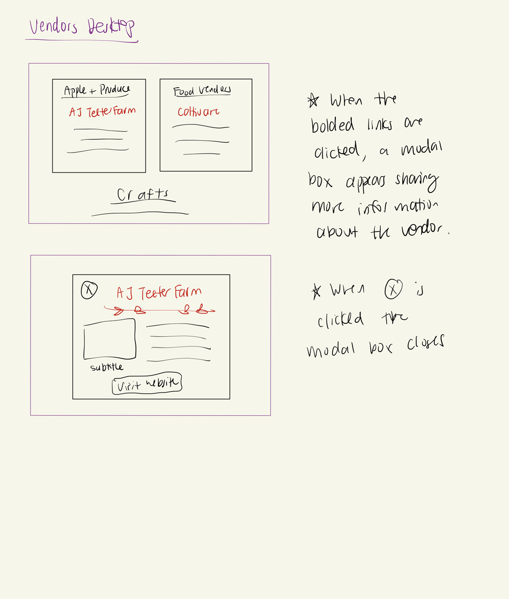

# Project 3: Design Journey

**For each milestone, complete only the sections that are labeled with that milestone.**

**Replace ALL _TODOs_ with your work.** (There should be no TODOs in the final submission.)

Be clear and concise in your writing. Bullets points are encouraged.

**Everything, including images, must be visible in Markdown Preview.** If it's not visible in Markdown Preview, then we won't grade it. We won't give you partial credit either. This is your warning.


# Existing Project

**Tell us about the project you'll be using for Project 3.**

## Project (Milestone 1)
> Which project will you add interactivity to enhance the site's functionality?

Project 2


## Audience (Milestone 1)
> Who is your project site's audience?
> This should be the original audience from Project 1 or Project 2.
> You should adjust the audience if necessary. Just make sure you explain your rationale for doing so here.

My project site's audience are Ithaca's nearby residents who are interested in either attending festivals or exploring what they have to offer. I have not adjusted it from before.


## Audience's Goals (Milestone 1)
> List the audience's goals that you identified in Project 1 or 2.
> Just list each goal. No need to include the "Design Ideas and Choices", etc. You may adjust the goals if necessary. However, any changes you make to the goals for this project should be clearly identified and justified.

- Goal 1: See what the Festival has to offer
- Goal 2: Know the time and place of Apple Fest, and how to get there.
- Goal 3:  Have an enjoyable experience, leave apple fest with desired items.


# Interactivity Design

## Interactivity Brainstorm (Milestone 1)
> Using the audience goals you identified, brainstorm possible options for interactivity to enhance the functionality of the site while also assisting the audience with their goals.
> Briefly explain idea each idea and provide a brief rationale for how the interactivity enhances the site's functionality for the audience.
> Note: You may find it easier to sketch for brainstorming. That's fine too. Do whatever you need to do to explore your ideas.

- Idea 1: A hamburger navigation for mobile.
  - The interactivity allows users to easily access different pages of my website since with a hamburger navigation, I can make the font size for my links bigger and more easily clickable. Thus it enhances the accessibility of my website since the navigation is easier.

- Idea 2: Popups for certain shops that display what items they offer and their website.
  - This interactivity allows visitors of the site to familiarize themselves more with the vendors of the apple fest before attending. It could help users further accomplish one of their goals - knowing what the apple festival has to offer by knowing what the stalls have to offer.

- Idea 3: A slideshow of images that display some goods for purchase at the apple fest or images taken at the apple festival.

  - This interactivity allows users to browse some photos of the goods for purchase at the apple fest and thus are informed about what the apple has to offer (Goal 1). By adding a slideshow, users can view more photos instead of a limited amount that fit on one page.

- Idea 4: Instead of a slide show, display thumbnails of images of the goods for purchase. These thumbnails can be clicked to change the image that is displayed in a certain div.

  - This interactivity also allows users to browse some photos of the goods for purchase at the apple fest and thus are informed about what the apple has to offer (Goal 1). By adding thumbnails, this is another way users can view more photos instead of a limited amount that fit on one page.

- Idea 5: A warning banner that notifies uses of rain (if it occurs) on a specific day of the apple fest.
  - This interactivity quickly notifies users to be prepared of rain during a certain day of the apple fest. It also informs those who are wondering if the apple fest will still occur on rainy days immediately, making the information obvious to them.


## Interactivity Proposal & Rationale (Milestone 1)
> Make a decision about your site's interactivity. Explain what you plan to implement and where it will go on your site.
> Describe the purpose of your proposed interactivity. Provide a brief rationale explaining how your proposed interactivity addresses the goals of your site's audience.

**Interactivity Proposal:**

For my interactivity I will select the following ideas.

- Idea 1: A hamburger navigation for mobile.
  - Location: All pages

- Idea 2: Popups for certain shops (perhaps 3) that display example items they offer and their website.
  - Location: Vendors page

- Idea 3: A warning banner that notifies uses of rain (if it occurs) on a specific day of the apple fest. Can be hidden and replaced with a rain exclamation icon.
  - Location: Home page

**User Goals Rational:**

#### Idea 1:
 - The purpose of this interactivity is to enlarge the font size of links when users access the website in mobile format.

 - This allows users to easily see links to different pages and access them easily. This enhances the accessibility of my website since navigating becomes easier on mobile.

 - This helps users accomplish Goal 1: See what the festival has a offer because they can see that there's more pages to explore which might not have been visible beforehand with a tiny navigation bar.

#### Idea 2:
 - The purpose of this interactivity is to allow visitors of the site to familiarize themselves more with the vendors of the apple fest before attending.

 - This helps users accomplish Goal 1: Knowing what the apple festival has to offer. By clicking on the links and getting a pop up, users will familiarize themselves more with the stalls they're interested in and know which items they might want to buy at the festival. Thus, this interactivity also helps users accomplish Goal 3: Leave the festival with desired items.

#### Idea 3:
- The purpose of this interactivity is to quickly notify users when it might rain during a certain day of the apple fest. It also informs those who are wondering if the apple fest will still occur on rainy days so that the information is obvious to them.

-  This helps users accomplish Goal 3:  Have an enjoyable experience, and leave apple fest with desired items. If visitors know that it will rain on a certain day of the apple fest, they could decide to come to the festival when the rain can be avoided. Those who are wondering if the apple fest will still occur even during rain will also now be informed, so they don't miss the chance to attend because they're unsure if the apple fest will still occur.


## Interactivity Design Ideation (Milestone 1)
> Now that you've made a decision about the site's interactivity, explore the possible design solutions for the interactivity.
> Sketch several iterations of your interactivity.
> Annotate each sketch explaining what happens when a user takes an action. (e.g. When user clicks this, this happens.)


1. mark
2. 

3. 

4. 

5. 


## Final Interactivity Design (Milestone 1)
> Review your sketches from the previous step and pick your final design.
> Create a _polished_ sketch (it's still a sketch, but with a little more caremark taken to communicate ideas clearly to the graders) to plan your interactivity.
> **Sketch out the entire page where your interactivity will go.** Add your interactivity to the sketch. Add any annotations to explain what happens when the user takes an action.
> Include as many sketches as necessary to communicate your design (ask yourself, could another 1300 take these sketches an implement my design?)

1. 
2. 
3. 

## "Ambitious" Interactivity Explanation
> In your own words, concisely explain why you believe your interactivity meets the "ambitious" requirement.

I believe my interactivity meets the "ambitious" requirement because it contains 3 different instances of "less ambitious activity" - pop ups (modal boxes), showing /hiding a banner and having a hamburger activity. I also plan to implement these ideas in a way that utilizes much more than 3 events on 3 different elements.

## Additional Information (Milestone 1)
> (optional) Include any additional information, justifications, or comments we should be aware of.

- **Note: The hamburger interactivity feature can only be seen/accessed in mobile**

# Interactivity Implementation Plan (Final Submission)

## HTML Interactivity Plan (Final Submission)
> Plan the HTML elements you will use in your interactivity.
> For each element, give its `id=` (if it has one) and any default styling (`class=`)

###Home Page
#### Hamburger Bar and Banner
- Hamburger Icon: `<div id='hamburger" class='hamburger-icon'>`
- Hamburger Exit Button: `<div id="hamburger-exit" class="close'>x</div>`
- Vertical Nav:  `<nav id="vertical-nav" class="vertical-nav">`

- Show More Button:  `<div id="show-more" class='show-more-btn'>`
- Banner - `<div id="rain-banner" class='rain-banner'>`
- Original Text -  `<p id="original-text">`
- Extra Text - `<p class="hidden" id="more-text">`
- Banner Exit Button:  `<div id="rain-banner-exit" class="banner-close'>x</div>`


###Vendors Page
#### Popups
- Popup ( On the Street Pitas) - `<div id="street-pita" class="popup-containers">`
- Popup Close (OtSP)- `<div id="sp-close" class='popup-btn'>x</div>`
- Popup (Little Tree)- `<div id="little-tree" class="popup-containers"`
- Popup Close (LT)- `<div id="lt-close" class='popup-btn'>x</div>`


## CSS Interactivity Plan (Final Submission)
> Plan the CSS classes you will need for your interactivity

- `.hidden` - display: none;
- `.close .popup-close` - close button X
- `.close:hover .popup-close:hover` - on hover change color
-  show more button `.btn` - styled like a regular button.
-  `.popup-containers` - darkens the background (body) and containers the popups
-  `.vertical-nav` - navigation page that takes up whole screen with nav bars flex-direction: column.
-  `.rain-banner` - banner to be placed on page.


## Interactivity Pseudocode (JavaScript) Plan (Final Submission)
> Write your interactivity pseudocode plan here.

### Home Page
```

when #hamburger is clicked:
  remove .hidden class from #vertical-nav element.
  add .hidden class to #hamburger

when #hamburger-exit is clicked:
  add .hidden class to #vertical-nav
  remove .hidden class from #hamburger

when #show-more is clicked:
  add .hidden class to #original-text
  remove .hidden class to #more-text
  add .hidden class to #show-more

when #rain-banner-exit is clicked:
  add .hidden class to #rain-banner

```
### Vendors Page

```
when On the Street Pita (paragraph on Vendors Page ) is clicked:
  remove .hidden from #popup-container1

when #sp-close is clicked:
  add .hidden to #popup-container1

when Little Tree Orchard (paragraph on Vendors Page) is clicked:
  remove .hidden from #popup-container2

when #lt-close is clicked:
  add .hidden to #popup-container2


```


# Grading (Final Submission)

## Interactivity Usability Justification (Final Submission)
> Explain how your design effectively uses affordances, visibility, feedback, and familiarity.

Two of my interactivity features: the hamburger and the rain banner effectively use affordances by changing color when the user hovers over the close icon for the banner and hamburger menu and the hamburger icon itself. The change in color assures users that the icons will have an interactive effect and encourages them to click. For the popup menus, bolded underlined links also encourage users to interact and click them. In terms of visibility, the close and hamburger icons are large and well contrasted with the background they are shown on. I made the links that led to popups bold, enlarged font and different colors which increased the popup link's visibility. When the interactive elements are clicked, the screens visibility change by hiding elements and showing others. Finally, my close and hamburger icons utilizes familiar design elements since an X and the 3 dashed lines are common amongst other sites to signify exiting an element or expanding a navigation bar.


## Additional Design Justifications (Final Submission)
> If you feel like you haven’t fully explained your design choices in the final submission, or you want to explain some functions in your site (e.g., if you feel like you make a special design choice which might not meet the final requirement), you can use the additional design justifications to justify your design choices. Remember, this is place for you to justify your design choices which you haven’t covered in the design journey. Use it wisely. However, you don’t need to fill out this section if you think all design choices have been well explained in the final submission design journey.

I chose to include an "Show More" button on my rain banner that shows new text instead of including all lines at once because I thought it would be easier to read and more aesthetically pleasing than if all lines were placed together at once.

## Tell us What to Grade (Final Submission)
> We aren't re-grading your Project 1 or 2. We are only grading the interactivity you added.
> Tell us where (what page) we can find your interactivity and how to use it.
> **We will only grade what you list here;** if it's not listed, we won't grade it.

- The interactivity I added was:
   - A hamburger navigation bar which is only visible in mobile formats (screen widths less than 720px). Replaces the horizontal desktop navigation bar.
      - Location: Hamburger Icon is in the top left corner on ALL 3 pages.
      - How to use: Simply click the hamburger icon to open the mobile navigation bar.
   - A fixed banner informing about rain on a certain day of the Apple Harvest festival.
      - Location: Bottom of home page.
      - How to use: Click the show more button to read more about the banner message, or click the close button to hide the banner.
   - Popup Boxes displaying more information about the vendors.
      - Location: Bolded and underlined links on the Vendors Page (only 2 popups, links both located underneath the food section, are currently implemented)
      - How to use: Click the bolded and underlined links underneath the Food Section in the Vendors page.


## Additional Resources/References (Final Submission)
> If you referenced other websites (or sources, including tutorials) on this project, list them here.

- In terms of how to code certain features: N/A.
- However I referenced many websites for content:
  - https://www.littletree-orchards.com/
  - http://www.onthestreetpitas.com/welcome.html
  - https://ithacavoice.com/2021/10/photo-gallery-apple-harvest-festival-2021/
  - https://www.downtownithaca.com/apple-harvest-festival/
  - https://unsplash.com/images
  ... and more


## Self-Reflection (Final Submission)
> This was the first project in this class where you coded some JavaScript. What did you learn from this experience?

Javascript is fun, and interactivity makes a website a lot nicer.


> Reflect on how HTML, CSS, and JavaScript together support client-side interactivity. If it's helpful, you can describe your mental model of client-side interactivity or explain how the general idea of showing and hiding content can be used to implement other forms of client-side interactivity beyond what you've done in this project.

HTML, CSS and Javascript come together to create more "spaces" for information that can be hidden/shown when requested. For example, calling the hamburger navigation when it's necessary on mobile but then hiding it when it's not, or hiding the banner after reading important information. By hiding content, one can declutter a webpage while optionally allowing users to view what they think is important.


> Take some time here to reflect on how much you've learned since you started this class. It's often easy to ignore our own progress. Take a moment and think about your accomplishments in this class. Hopefully you'll recognize that you've accomplished a lot and that you should be very proud of those accomplishments!

I recognize that I accomplished a lot by creating 3 web pages and adding a multitude of interactivity on my website. However I would also like to say that this project look A LOT of time and I have well over 1000 lines of css in my style.css file. I definitely but a lot of work into making my website look pretty.
