# Project 2: Design Journey

**For each milestone, complete only the sections that are labeled with that milestone.**

Be clear and concise in your writing. Bullets points are encouraged.

**Everything, including images, must be visible in Markdown Preview.** If it's not visible in Markdown Preview, then we won't grade it. We won't give you partial credit either. This is your warning.

## Understanding Users (Milestone 1)

**Make the case for your decisions using concepts from class, as well as other design principles, theories, examples, and cases from outside of class.**

You can use bullet points and lists, or full paragraphs, or a combo, whichever is appropriate. The writing should be solid draft quality but doesn't have to be fancy.

### Audience (Milestone 1)
> Briefly explain your site's audience. Be specific and justify why this audience is a cohesive group with regard to the Ithaca Apple Harvest Festival. .

My site's audience are Ithaca's nearby residents who are interested in either attending festivals or exploring what they have to offer.

### User Interview Questions (Milestone 1)
> Plan the user interview which you'll use to identify the goals of your site's audience. You may use the interview template below and revise it as much as you desire. You are **required to author 3 of your own questions**..

**User Interview Briefing & Consent:** Hi, I am a student at Cornell University. I'm currently taking a class on web design and for a project, I am re-designing the web site for Ithaca's Apple Harvest Festival. I'm trying to learn more about the people that might use this site. May I ask you a few questions? It will take about 10 minutes. You are free to quit at any time.

(These questions assume you are interviewing a festival attendee at the festival. If you didn't attend the festival, you may revise the question an instead ask the participant to recall the last festival/event they attended. Do not ask them to speculate about visiting the Apple Harvest Festival. User speculation provides biased data.)

1. Please tell me a bit about yourself. You may omit any personal or private information.

2. What brought you to visit the Apple Harvest Festival last week?

3. Before you came to the festival, did you seek out any information about the festival before getting here?
3a. If yes, What information were you looking for? Did you find it? How did you access that information?

4. When you arrived at the festival, did you seek out any information about the festival?
4a. If yes, What was that information? How did you obtain it?

5. When you were participating in the festival, did you seek out further information about the festival?
5a. If yes, what was the information? Where did you seek it?

6. After attending the festival, is there any information you wish you had known about the festival beforehand or information that you weren't able to find beforehand?
6a. What would you have done differently if you had known early.

7. Did you look forward to anything from the festival? Did you find what you were looking for? How?

8. Did you have any experiences from the festival you'd want to share with others in the future?

9. How did you feel when you attended Apple Fest? How did you feel when you left it?

10. Would you attend next year?
a. If you are going to attend next year, what would you do differently or the same?
b. If you are not going to attend next year, why?

...

11. What haven't I asked you today that you think would be valuable for me to know?

**After the interview:** This was really helpful. Thank you so much for agreeing to speak with me today. Have a great day!

### Interview Notes (Milestone 1)
> Interview at least 3 people from your audience. Take notes and include those notes here. Make sure to include a brief description of each interviewee.

**Interviewee 1:**

About: Taea Roberts, sophmore at Cornell university. Studying Biology, like to draw and play games, sweet food, scented things, spiders.

Q1. This was my first year attending Apple Fest. I first learned of it through Info 1300 which I took last year where I also needed to make a website on Apple Fest. Like fall vibes.s

Q2,3,4,5. Knew the location through 1300. Did not look at Apple Fest times - went with group of friends. Just wandered around.

Q6. They should've provided information about how long the apple cider line would've gotten in a very short amount of time - 5 minutes after it opens.
6a. If I had known, I would've gotten on line earlier.

Q7. Looking foward to eating the food, wanted to buy crafts items. How did I find it?
- Organized decently. All the foods are in one lane.
- Carnival stuff in another line.
- Trinkets in another
- Look down intersection and know what is there.

Q8. Don't really have much to say. Wasn't that eventful.
  -> Why?
    - Nothing that I didn't expect to happen happened.
    - Went looked at food, bought some trinkets
    - Expected it to be mostly food
    - Lines were not unexpected.

Q9. Enjoyed it because I was in friends, and it was raining. Was a bit difficult to eat under the rain but we managed to find shelter.

Q10. I will attend next year, bit on fence because there wasn't much to do.
- Go if you're hungry, if not you don't really have to go
- After getting full there's not much to do.
- Besides food: carnival and vendors.
  - Rain because carnival stuff sucks.
  - Spent so much money before you need to go.

Q11. Bring cash because there are some stores who don't accept credit

**Interviewee 2:**

About: Camellia, 19, sophmore, CS major in Cornell University, Engineering. Playing video games, started glass painting, DIY

Q2: Just wanted to hang out with friends after prelims. (Why should you attend?) Am RA - brought residents there via bus.

Q3. Looked for timing, date, location.
Found the information via google (did not go on website)

Q4,5. Looked at signs. Just followed flow of people. navigating layout of festival: - initally confusing but signs for crafts and food was very well organized. Taking a look to see how things were organized help. Found out the fair, did it by walking around the festival.

Q6. Would like to know about the exact things they were selling. Not very descriptive about the items they were selling just booth names. Weather related stuff, such as rain.

Went on Saturday, didn't get any food items, just crafts. If I knew that people would still go on Sunday I would as well just to get more items such as good. I also purchased a pocket watch for $30, but would like to get a mechanical watch next time - they were $50 but I didn't know they were $50.

Q7. Pocket Watches - heard from a friend. Looked for room decor (fall stuff!)

Q8. Lines were way too long. Went on Saturday 11am. Apple Cider Donuts stretched entire blocks. Should have more booths or expand selection.

Q9. "I felt very excited to see the different things. Each booth had many things for me to look at and since I am a window shopper"

Q10. I will attend as long as my friends are atttending. Want to check out the watches again - get the mechanical one and try some food.

Q11. Maybe it'd be nice to know how to pay - like with cash or credit. I wanted a mechanical watch which was $50 but I didn't have $50.

**Interviewee 3:**

Q1. Joyce, Senior at Cornell, Major CS. Some things I like - music, playing piano. Watching anime and movies + Wushu.

Q2. Try to go every year, it's fun!

Q3.Normally just go and walk around.

Q4. Didn't seek out, but would be nice to have a map. May have had but didn't notice.

Q6. A list of vendors that were going to be there. Were going to get Apple Cider Donut, but learned that Amish booth did not sell freshly made sider.

Q7. Apple Cider Donut. Amish booth did not sell, so we went to another stall on sunday.

Q8. Generally better to go in the morning than afternoon because line is shorter. Funnel cake stand had big line after noon. Before then there is no line. Before noon don't need to wait half and hour+. Apple Cider Donuts - hours and a half wait time.

Q9. It was fun. Less stalls this year than previous years, disappointing. Felt like food items were limited because less stalls. Enjoyed looking at various crafts. Fruit samples of food wine and maple syrup. Apply crisps stall, next to apple cider - good plan, to keep food together and get crisps while wait for donut.

Q10. Enjoyed previous years' because more stalls.

Q11. Bring cash, because other people do not.

### Goals (Milestone 1)
> Analyze your audience's goals from your notes above. List each goal below. There is no specific number of goals required for this, but you need enough to do the job (Hint: It's more than 1 and probably more than 2).

Goal 1: See what the Festival has to offer
- **Design Ideas and Choices** _How will you meet those goals in your design?_
  - I will have a page on my website that describes the content of the festival in 3 parts/"streets": entertainment, food, art/trinkets just like how the actual apple festival was organized
    - Information about the most popular items

- **Rationale & Additional Notes** _Justify your decisions; additional notes._
  - By having an about page, any viewers who go on the website seeking information about what will be present at the festival knows exactly what to expect.
  - Viewers who want to find specific topics, such as food, or art/crafts, or entertainment can navigate my website to find exactly that section.

Goal 2: Know the time and place of Apple Fest, and how to get there.
- **Design Ideas and Choices** _How will you meet those goals in your design?_
  - I will provide detailed instructions where the apple fest is, how to get there and when it occurs.
  - Possbily also a map of stalls.
  - Account for different means of transportation.

- **Rationale & Additional Notes** _Justify your decisions; additional notes._
  - People who want to go to apple fest obviously need to know where it is located.
  - Important to provide a variety of instructions: written ones for readers who are familiar with street names, maps for visual learners and varying information to people arriving on different modes of transportation.

  Goal 3:  Have an enjoyable experience, leave apple fest with desired items.
  - **Design Ideas and Choices** _How will you meet those goals in your design?_
    - I will mention important details about the apple fest such as:
      - Certain booths only accepting cash
      - Weather accomendations
      - General wait times before and after a certain time.
      - Most most popular goods, etc
      - Earliest time to attend
  - **Rationale & Additional Notes** _Justify your decisions; additional notes._
    - By mentioning the above, visitors are likely to have a more comfortable time since they will
      - Know to bring cash in case an item they want can't be paid for with credit.
      - Know what to do in times of rain, where to seek shelter.
      - Know which certain stalls are popular so they can better prepare for those lines and come early if they wish.

## Content Planning (Milestone 1)

Plan your site's content.

### Your Site's Planned Content (Milestone 1)
> List the content you plan to include your personal website. This should be a comprehensive list.

- Date and Time of Apple Fest
- Short description of History of Event
- Location (Downtown Ithaca)

- A "Apple Fest Tips Section"
  - Detailing general information that's important to know
  - What to do in rain
- Popular food items + expected price ranges
- Best time to attend

- Vendors:
  - Food; Crafts; Entertainment
  - Highlights of each section (photos)
- Note of payment: some vendors are cash only

- Map
-  Directions - written instructions
  - A downloadable map
  - Parking information
  - Bike/Walking Directions
  - Bus information

####
### Content Justification (Milestone 1)
> Explain (about a paragraph) why this content is the right content for your site's audience and how its addressed their goals..

- My site's audience are Ithaca's nearby residents who are interested in either attending festivals or exploring what they have to offer.

Thus it is important that they know the time, date and location of the festival. Since they are nearby residents, they should be able to  navigate to the festival. Directions and a map will assist with that as well as what to do if you're arriving with different modes of transportation.  If they're arriving to the apple festival, they will likely also want to know what they can do or experience there such as the vendors or goods can be found.

## Information Architecture (Milestone 1)

### Content Organization (Milestone 1)
> Document your iterations of card sorting here.
> Include photographic evidence of each iteration of card sorting and description of your thought process for each iteration.

1. 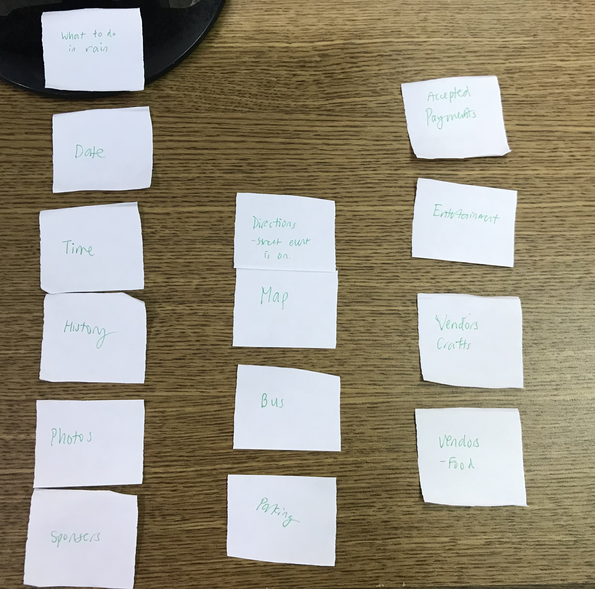

In this first card short I organized the date, time, a brief introduction of the history of the apple fest together on one page - the home page which viewers would see first. The home page also would include some photos of the event,  and what to do if it rains.

The second page would have directions and important information for people getting there by foot, bus or car (parking). Finally the last page would include accepted payments and information about the sights split into 3 categories.

2. 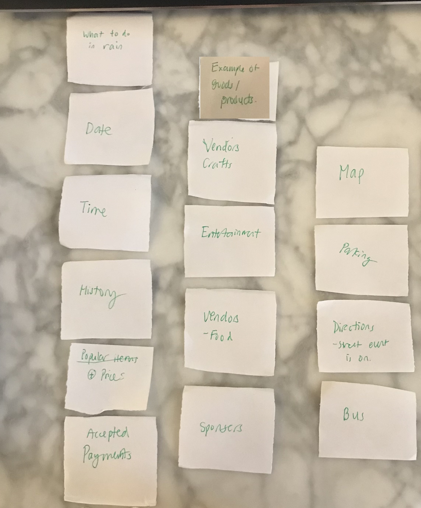

My second card sort expanded the home page to include the information in my first card sort as well as new information: Popular Items and Accepted Payments.

I also decided to add some examples of goods and products on the page of vendors.

Update: I decided that including the sponsors would be very taxing to gather all the informations about the sponsors of the event and all their relative logos and did not include it in my designs.

### Final Content Organization (Milestone 1)
> Which iteration of card sorting will you use for your website?

I used my second card sort minus sponsors

> Explain how the final organization of content is appropriate for your site's audiences and their goals.

This organizes my content into 3 pages: Home, Vendors, and Map and Directions. The home page includes the most important information about the festival such as time, date and place.  The primary inforamtion about the festival is easily accessible to my audience. Furthermore, I will likely include buttons on my home page to vendors and the map/directions page so people can easily navigate to those sections. In terms of goals: Vendors tell the audience what to expect at the festival and map and directions tell them how to get to there.

### Navigation (Milestone 1)
> Please list the pages you will include in your personal website navigation.

- Home
- Vendors
- Map and Directions

> Explain why the names of these pages make sense for your site's audience and their goals.

Home page describes the primary information a person visiting my site should know about the apple fest, as well as any special tips pertaining to the festival itself like bringing cash or what to do in rain. My Vendors page helps my audience  learn what the festival has to offer. Maps and Directions help the audience know where the festival is at and how to get there.

## Visual Theme (Milestone 1)
> Discuss several (more than two) ideas about styling your site's theme. Explain why the theme ideas are appropriate for your target audiences. Note the theme you selected for you site and why it's appropriate for the audience and their goals.

Visual Themes:

Theme 1:
  - Red, Green colors as the color of apples.
  -  Images of Apples (It's Ithaca Apple Harvest Festival)
  - Images of trinkets and baked goods to convey creativity of the festival

  - Simplistic and big font for readability.
  - Navigation bar for accessibility
  - Buttons for ease of navigation around site.

Theme 2:

  - Smiling people to convey happiness
  - Orange background color so the website has a festive fall mood
  - Fancy header font to put emphasis the the festival.
  - Navigation bar for accessibility

Theme 3: ( Emphasis on professionalism)
  - Orange, Yellow, Red colors symbolizing fall. Enought white space so website looks modern + uncluttered.
  - A collage of images which symbolize coming together
  - Simplistic professional font   
  - Footer and Nav - common design patterns

I chose Theme 1 because it focuses on accessibility and creativity and its photos all have a purpose to convey the theme of the festival.

## Design (Milestone 1)

Document your site's layout.

### Layout Exploration (Milestone 1)
> Iterate on your site's design through sketching.
> Sketch both the mobile and desktop versions of the site.
> Here you are just exploring your layout ideas. You don't need to sketch every page.
> Provide an explanation for each sketch explaining the idea and the design patterns you are leveraging.

 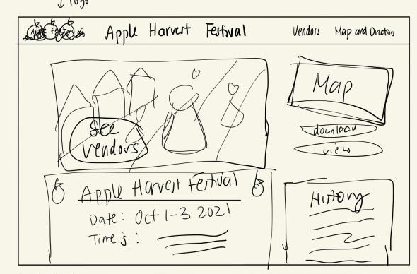

In this layout I have:
1. Navigation Bar - common design pattern, easy for my audience to travel to different pages.
2. Header - The topic of my site is in a large font, Apple Harvest Festival.
3. The date and time of the festival is in large font and easy to read. I have buttons to different pages from my home page: Vendors and Maps and Directions, so navigating my site is simple.

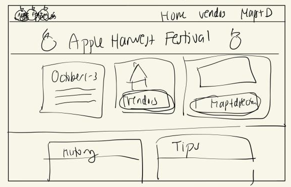

Alternative home page Layout

1. Navigation Bar - common design patterns
2. Reading left to right, so information of festival like date and times are on the left, an image of a person is to the right to seem more inviting.
3. Large Headers such as Map and Vendors to differentate sections of Information
4. Visual Imagery of a map to signify "View Map of Event"

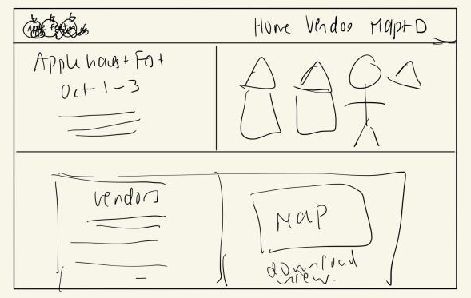

1. "Hero Image" of event - eye catchy
2. Title and important information under hero image.
3. Layout ultizes sidebar to detail other infomation like history.
4. Buttons on hero image and sidebar to navigate to different pages easily.

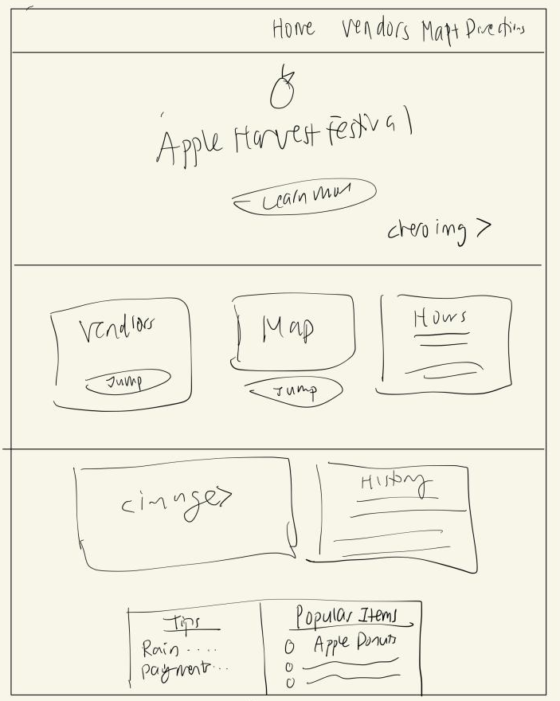

1. This is another example of a layout with a hero image
2. Includes history of the event as well as 3 boxes for times, vendors, maps

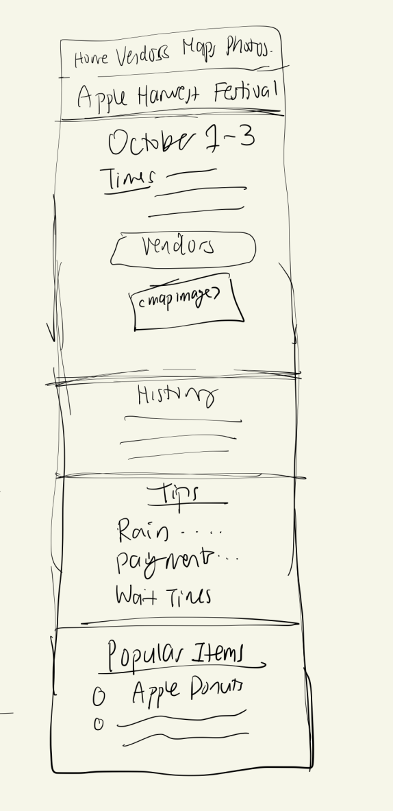

- This is a mobile version of my home page. For the mobile version I increated the font size of important information and got rid of unnecessary boxes for easy reading and scrolling. The most important information about the event is at the top of the page.

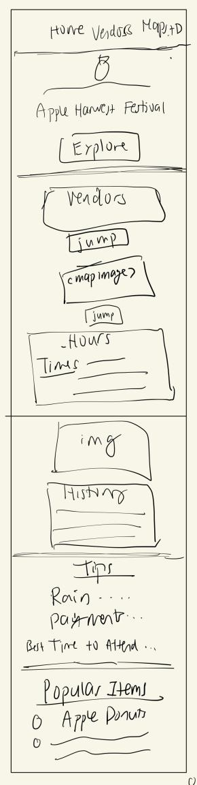
- Mobile version of my home page including an hero image

### Final Design (Milestone 1)
> Include the final sketches for each of your pages.
> The sketches must include enough detail that another 1300 student could implement them.
> Provide a explanation for each sketch.

**Mobile Design:**
- All pages include a navigation bar so my viewers can easily navigate between pages.

- My mobile home page is the sketch that includes the hero image
- It includes the most important information of the festival at the top of the page or easily accessible via buttons found on the top of the page.
- Scrolling down will show you different information about the event - history, tips and popular items.

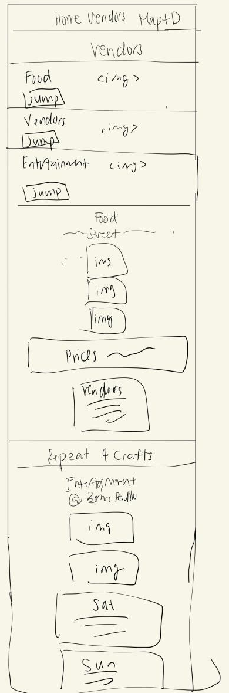

- There will be large clickable images that jump to different sections of webpage.
- The vendors of the events are split into 3 gorups -food, Crafts and Entertainment
- Each section will include an image and some highlights of what to see. In entertainment it will provide time of performances.

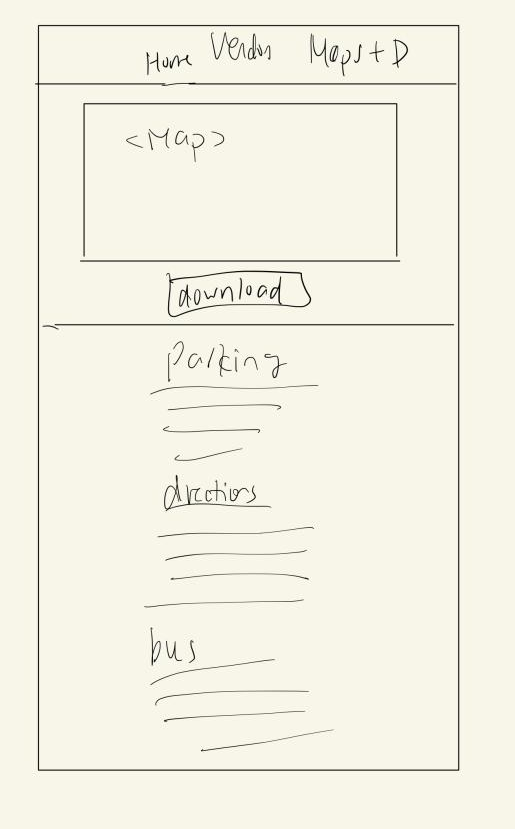

- A large map will be the first thing the audience sees, and a button will be found close to the map that allows it to be downloaded.
- Scrolling down will provide directions for getting to the event such as the street is on, what buses to take and the parking information if one gets there by car.

**Desktop Design:**

- Big hero image welcoming visitors to come learn more about the Apple Harvest Festival
  - Common design pattern of a Navigation bar is present.
  - Important event inforamtion such as date and time of the event and buttons to vendors and directions are easily found at the top of the page.
    - Assists in accessibility so my viewers don't have to think to find something
  - Brief section of the history of the event to curious visitors
  - Helpful Tips Section and Popular Items section to inform first time visitors (minimize confusion) and provide them something to look forward to - trying out famous/popular foods.

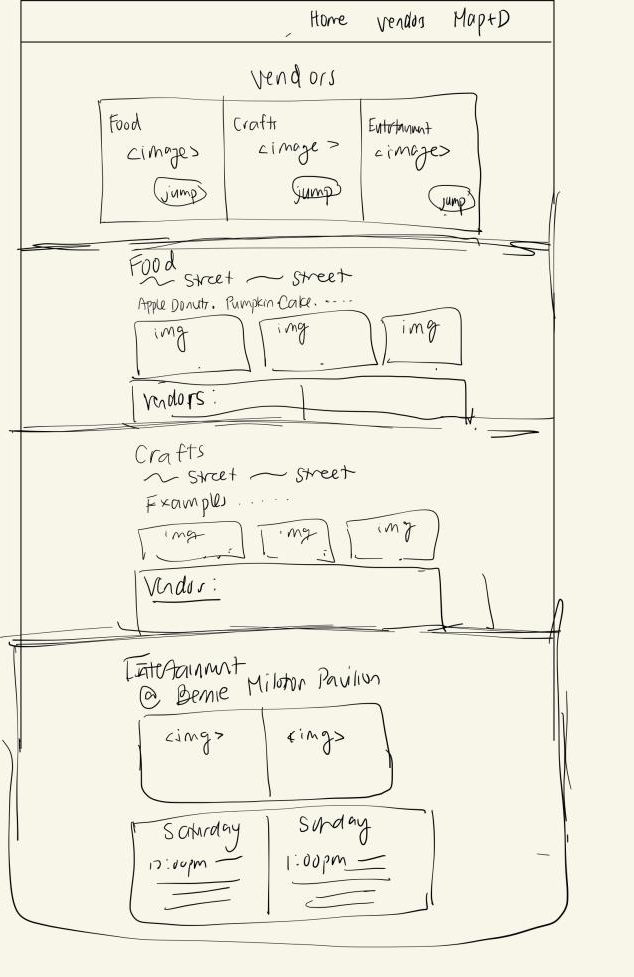
- Big header that lets visitors know what to expect - information about vendors.
- Vendors are split up into 3 groups - Food, Crafts and Entertainment for easy navigation and to minimize chance of audience to be overwhelmed and confused
- Navigation bar present - common design pattern.
- Each section will include an images and highlights of the respective section.
    - And the streets where each section can be found in real time at the festival.

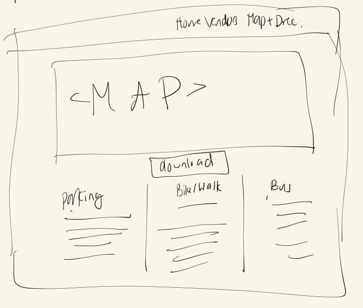

- A big map is provided for visual learners, with a download button in case they want to save it on their devices
  - Improves **accessibility** because not everyone will have internet during apple fest.
- Since people tend to read from top to bottom.
  - By scrolling down, people can find directions that **accompany** the map - street names that might be familiar to those travelling by foot, familiar bus routes, or parking information for those who want to come by car.

### Design Rationale (Milestone 1)
> Explain why your design is appropriate for your audience. Specially, why does your content organization, navigation, and site design/layout meet the goals of your users? How did you employ design patterns to improve the familiarity of the site for your audience?

My design is appropriate for my audience because most, if not all information on my site is dedicated to informing users about the Apple Fest, whether it be the history of the event, the vendors at the event, the directions to the event. My audience is people who are interested in either attending festivals or exploring what they have to offer, so the fact that my website provides such detailed information about the event clearly matches their needs.

In terms of goals I said that my users want to:
1. See what the festival has to offer
2. Find directions on how to get to the festival
3. Have an enjoyable time

My website meets Goal 1 by providing detailed information on the festival's offerings on the  Vendors page. By seperating the vendors into 3 related groups, my audience has a less likely chance to get confused or overwhelmed by all the booths. There's also images so they know what to expect in each section. My website also has another page dedicated on providing directions and a visual map of the event to meet Goal 2. To meet Goal 3: have an enjoyable time, I sought to inform visitors of my website some tips they should know before coming to the event, and what food items they should try, and what to do in case of rain, so they can best maximize their time and experience at Apple Fest.

## User Testing (Final Submission)

### Finished Desktop & Mobile Website (Final Submission)
> Include screenshots of both the desktop and mobile version of your site that you will be using for user testing. (We need to see the "before" testing version of your site.)

**Mobile Screenshots:**

####Home Mobile
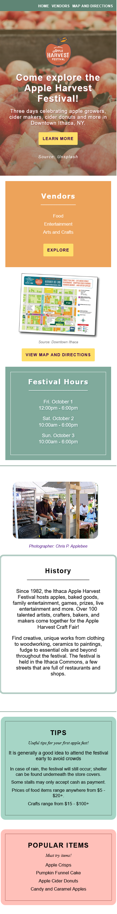

###Vendors Mobile
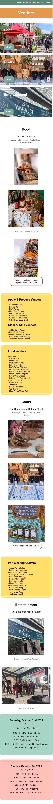

####Map Mobile
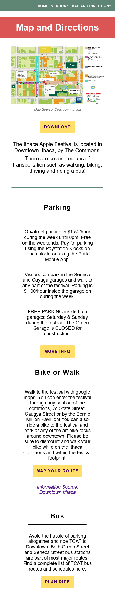

**Desktop Screenshots:**
####Home Desktop

####Vendors Desktop
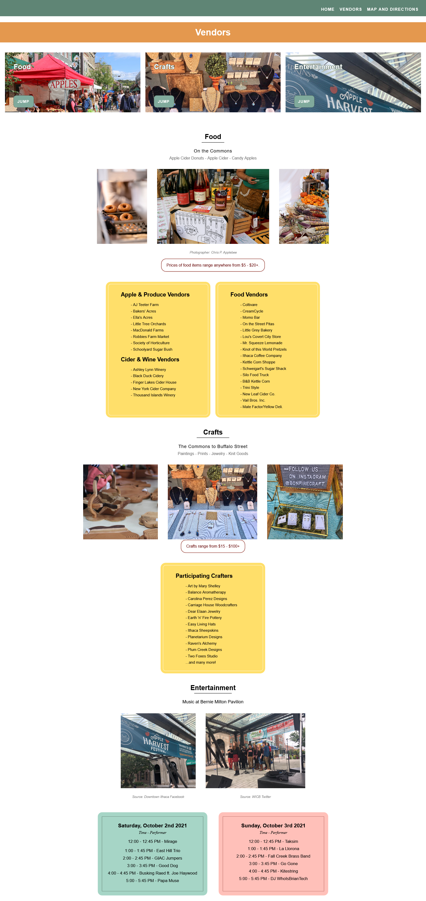

####Map Desktop
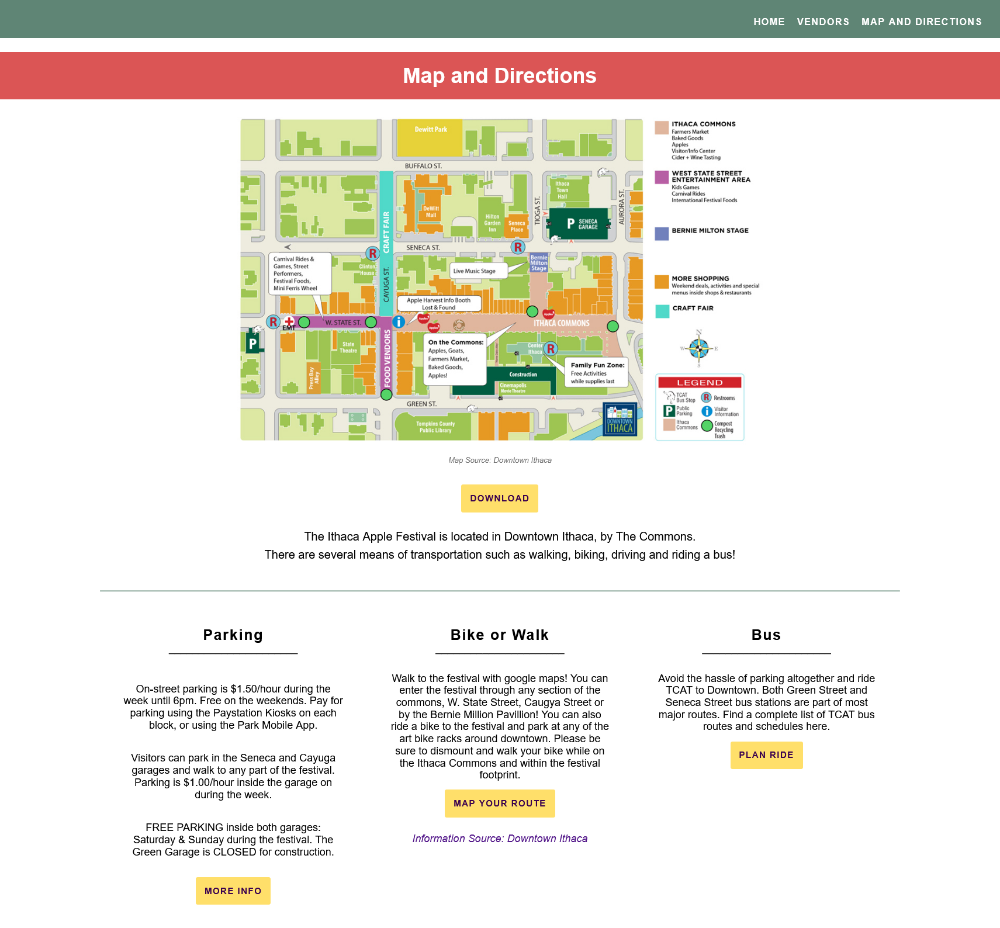

### User Testing Tasks (Final Submission)
> Plan out your user testing tasks before doing your user testing. These must be actual user testing tasks. **Tasks are not questions!**

1. You're are Cornell Student interested in shopping for some art pieces or craft items for your dorm. Please show me how you would use the website to find out where to go to find relevant stalls.

2. Determine when the AHF starts and ends and when you should arrive at the Apple Harvest Festival.

3. Find where you would park your car if you were to drive to the Apple Harvest Festival.

4. Name some typical food items that would be avaliable for purchase at the Apple Harvest Festival using the website.

5. Find out the types of payments the stalls at the AHF accept and a reasonable amount of money to bring.

### User 1 - Testing Notes (Final Submission)
> When conducting user testing, you should take notes during the test. Place your notes here.

1. Navigation Bar -> Main -> Crafts  (See participating crafters) (but not sure where locations are) So I went to maps and directions and see the craft fair directions.

2. Scroll through home page says Festival Hours.

3. Scroll through main page, don’t see anything. Would probably be in maps and directions (accessed via nav bar) Sees parking.

4. Home page (Popular Items) -> Sees those food items at the AHF.

5. Scroll to Botton and see tips ( some stalls accept cash reasonable amount to bring)

### User 1 (Final Submission)
> Using your notes from above, describe your user by answering the questions below.

1. Who is your user, e.g., where does the user come from, what is the user's job, characteristics, etc.?

My user's name is Camilla. She is from Connecticut, a sophmore CS major at Cornell University, Engineering.  She likes playing video games, started glass painting, DIY things.

2. Does the user belong to your audience of the site? (Yes / No)
> If “No”, what’s your strategy of associating the user test results to your audience’s needs and wants? How can your re-design choices based on the user tests make a better fit for the audience?

Yes, she belongs the site's audience because she is interested in things offered at the festival such as crafts, and she is nearby resident so the festival is closeby.

### User 1 (Final Submission)
> Report the results of your user's test. You should explain **what the user did**, describe the user's **reaction/feedback** to the design, **reflect on the user's performance**, determine what **re-design choices** you will make **for EACH task**. You can also add any additional comments.

Task: TODO: copy task here
- **Did you evaluate the desktop or mobile design?**
  - Pick one: desktop
- **How did the user do? Did they meet your expectation?**
  - The user navigated my site well and did meet my expectations. I created a lot of buttons and a nav bar and as expected they were used to navigate my site.
- **User’s reaction / feedback to the design** (e.g., specific problems or issues found in the tasks)
  - The user seemed to have a pretty smooth time navigating my site and found everything very quickly. However, there was one task that took longer than expected - to find out where the craft stalls were located she first checked the vendors and then the maps, which was an extra step as the information was located on the map.
- **Your reflections about the user’s performance to the task**
  - I believe for task one where she was tasked to find the location of the stalls, she saw the topic was finding vendors and then searched for a page that included all the vendors. She did not think the topic was directions or navigation as I had expected, and she missed the small subheading that spoke of what streets the craft stalls started/ended.
- **Re-design choices**
  - If redesigning my website I would put a button next to each vendors section that leads the user to the main map, or change the statement of where the location of the stalls are to a bigger and larger font as it was easily missed.
- **Additional Notes**
  - I would put a button next to the vendors because stops the user from having to do more work to find the map/location of stalls - they would just need to click the button to navigate the map instead of scroll all the way up to the nav bar.

### User 2 - Testing Notes (Final Submission)
> When conducting user testing, you should take notes during the test. Place your notes here.

1. Main -> Vendors -> Explore -> Jump to (Vendors Page) -> Looks at images -> Jump to crafts section -> Reads stall names.
2. Looked at map for festival hours -> Clicked download, performance times were there do decide to go where performances start.
3. Map + Directions -> Look at map -> Parking
4. Vendors -> Subheading that says apple cider , donuts + reads shop names (kettle corn)
5. Main -> tips -> $50

### User 2 (Final Submission)
> Using your notes from above, describe your user by answering the questions below.

1. Who is your user, e.g., where does the user come from, what is the user's job, characteristics, etc.?

My user is Rachel Lai, a sophmore studying Chem E at Cornell Engineering. She is from New York City, is female and a little short. Likes Korean Dramas and sweets.

2. Does the user belong to your audience of the site? (Yes / No)
> If “No”, what’s your strategy of associating the user test results to your audience’s needs and wants? How can your re-design choices based on the user tests make a better fit for the audience?

My user would belong to my audience because she is a nearby resident and she likes trying out sweets. The apple harvest festival would have a lot of sweets for her to try, thus she would be encouraged to attend and would seek out information about the festival.

### User 2 (Final Submission)
> Report the results of your user's evaluation. You should explain **what the user did**, describe the user's **reaction/feedback** to the design, **reflect on the user's performance**, determine what **re-design choices** you will make **for EACH task**. You can also add any additional comments.

Task: TODO: copy task here
- **Did you evaluate the desktop or mobile design?**
  - Pick one: desktop
- **How did the user do? Did they meet your expectation?**
  - My user met most of my expectations except for one task, task 2. She looked the map and direcitons page first to find out the festival times so that was a little unexpected.
- **User’s reaction / feedback to the design** (e.g., specific problems or issues found in the tasks)
  - My user thought my site was very pretty and very clean, but as stated above, she expressed confusion for not being able to find the festival times on the map right off the bat.
- **Your reflections about the user’s performance to the task**
  - I think Rachel performed very well to my tasks. She was able to find things very quickly, and from her feedback she seemed to really like the photots I included.
- **Re-design choices**
  - For my redesign choices, I would include festival times and entertainment times at the side of the map.
- **Additional Notes**
  - TODO: I would include times in my map + direction section so that if people were looking at the map + directions page in order to find out when the festival starts such as Rachel was doing they would be able to.

### User 3 - Testing Notes (Final Submission)
> When conducting user testing, you should take notes during the test. Place your notes here.

1. Go home page -> Maps and directions -> zoom in -> takes too long to search for crafts.
2. Navigates to map -> Does not find hours -> Navigates to home and scrolls.
3. Look at map and looks at parking (seneca garage) on map
4. Goes to home page -> Popular Items
5. Home -> Learns more -> Tips

### User 3 (Final Submission)
> Using your notes from above, describe your user by answering the questions below.

1. Who is your user, e.g., where does the user come from, what is the user's job, characteristics, etc.?

My user's a male sophmore who is a student from Cornell University. He is a CS major with an interest in maps and astronomy. I would not say that is part of my audience because he does not seem to have any interest in festivals nor the the themes around the Apple Harvest Festival.

2. Does the user belong to your audience of the site? (Yes / No)
> If “No”, what’s your strategy of associating the user test results to your audience’s needs and wants? How can your re-design choices based on the user tests make a better fit for the audience?

No, my user does not belong of my site's audience. I would take the results of my user test to see how well my site fares with people who are not previously interested in festivals and what they have to offier. For someone who isn't interested in festivals - what does interest them, what what could convince them to be interested? I will then work on improving my site to appeal to those without a prior interest to increse the potential a visitor has to become part of my audience after visiting my site and gaining interest.

### User 3 (Final Submission)
> Report the results of your user's evaluation. You should explain **what the user did**, describe the user's **reaction/feedback** to the design, **reflect on the user's performance**, determine what **re-design choices** you will make **for EACH task**. You can also add any additional comments.

Task: TODO: copy task here
- **Did you evaluate the desktop or mobile design?**
  - Pick one: mobile
- **How did the user do? Did they meet your expectation?**
  - The user only answered half the the tasks the way I expected, and always attempted to find the information required on my Map and Directions page before navigating to another page after not finding the information.

   - This did meet my expectation because the user was not part of my audience. Most of my tasks, such as finding location of crafts, were aimed towards people with a prior interest in the festival and want to learn more about it. However, since my user did not have a prior interest, they had a difficult time accomplishing tasks that required them to be interested in the topic at hand.

   - Once they got used to looking at other pages, for example after task 3, they knew to go to the home page to search for information related to task 4 and 5.

- **User’s reaction / feedback to the design** (e.g., specific problems or issues found in the tasks)
  - My user expected most of the information to be on the map, and were frustrated when it didn't include what the tasks wanted.
- **Your reflections about the user’s performance to the task**
  - I believe they are mostly a visual learner and since the map did not include information such as times, etc they were quite unsure before realizing they could navigate to further pages.

- **Re-design choices**
  - I will most likely redesign my map and directions page to include times of the event.
  - Alternativity: combine the map and directions page with the home page.

- **Additional Notes**
  - Since both Aditya and Rachel first went to the map to look for times for the event, the map and directions page should include the information they need.
  - Perhaps having the map page seperate from the home page is not a good idea. Rather if it was grouped with the home page - information such as times of the events would be easily accessible from the same page.

### Potential Changes Based on User Testing (Final Submission)
> What changes would you make to your design based on user testing?

1. I would include information of the AHF times next to the map in the maps and directions page.

2. I would include a "jump to map" button on the vendors page which leads you to the location where each of the vendors set up on the map.

## Self-Reflection (Final Submission)
> This was the first project in this class where you were able to follow a user-centered design process from start to finish. What did you learn from this experience?

I leanred that coding a website for users takes an immense amount of work. I poured many many hours into this project, and I still feel as if there is so much to go before I finally have something I'm statisifed with. It really puts into consideration how much work it takes to make a website and I am super happy that my next website is a group project so I can have some assitance.

> Take some time here to reflect on how much you've learned since you started this class. It's often easy to ignore our own progress. Take a moment and think about your accomplishments in this class. Hopefully you'll recognize that you've accomplished a lot and that you should be very proud of those accomplishments!

I've learned how to use media queries which is very cool! I've also learned how to make a navigation bar, and how to wrap stuff in divs and use flex box so they line up how I want them to.
